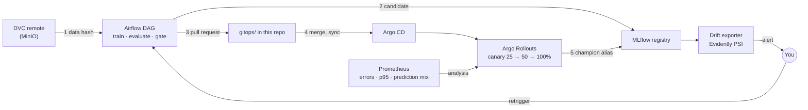

# MLOps

An end-to-end MLOps demo: a breast-cancer classifier that goes from a versioned dataset to a gated canary in production, and back to training when the data drifts.

Training never deploys. It opens a pull request. A person merges it, Argo CD applies it, and Argo Rollouts shifts traffic step by step while Prometheus checks both service health and the model's prediction mix. Only when the canary passes does the registry's `champion` alias move.



Each numbered arrow is a handoff with one thing crossing it:

| # | Handoff | What crosses | Owner |
|---|---|---|---|
| 1 | DVC → Airflow | The dataset's md5, read from the `.dvc` pointer | The data pipeline |
| 2 | Airflow → MLflow | A new model version with the alias `candidate` | The DAG |
| 3 | Airflow → Git | A PR changing only `MODEL_VERSION`, `MODEL_URI` and `model-version` | A human reviewer |
| 4 | Git → cluster | A new pod template, which starts a canary | Argo CD |
| 5 | Rollout → MLflow | The `champion` and `previous` aliases | The rollout's final step |

Manifests always carry a version number (`models:/cancer-classifier/7`), never the moving `@champion` alias, so what runs is fully determined by a Git commit.

## Repository layout

| Folder | What it is | Runs on |
|---|---|---|
| [`platform/`](platform) | MLflow tracking server, Postgres backend, MinIO for artifacts and DVC data | Docker Compose |
| [`experiments/`](experiments) | Train, sweep, promote and predict scripts against MLflow | Your machine |
| [`data-pipeline/`](data-pipeline) | DVC-tracked dataset and a `prepare → train → evaluate` pipeline with lineage tags | Your machine |
| [`feature-store/`](feature-store) | A small Feast repo showing point-in-time training retrieval vs online serving | Your machine + Redis |
| [`orchestration/`](orchestration) | Airflow 3 with the `ml_training` DAG: fetch by hash, train, re-score the champion, register, open a PR | Docker Compose |
| [`gitops/`](gitops) | The model server Rollout, Service, canary analysis and the Argo CD Application | kind, via Argo CD |
| [`cluster/`](cluster) | kind + Argo CD + Argo Rollouts + Prometheus setup, and a k6 load generator | kind |
| [`monitoring/`](monitoring) | Drift exporter that follows the champion, Prometheus alert rules, Grafana | Docker Compose |
| [`serving/`](serving) | Standalone serving experiments: BentoML, KServe (Standard mode), k6 load tests | Your machine / kind |
| [`autoscaling/`](autoscaling) | CPU HPA vs KEDA on in-flight requests, and queue-based scale-to-zero | kind |
| [`drills/`](drills) | Failure drills: a flipped-label model the canary must reject, and resolving an aborted canary | — |

## Prerequisites

Docker, [kind](https://kind.sigs.k8s.io/), kubectl, Helm, the [kubectl-argo-rollouts](https://argoproj.github.io/argo-rollouts/installation/#kubectl-plugin-installation) plugin, and Python 3.12. Plan for about 8 GB of free memory for the full loop.

## Run the full loop

### 1. Platform

```bash
cd platform && docker compose up -d
```

MLflow is on http://localhost:5000, the MinIO console on http://localhost:9001 (`minioadmin` / `minioadmin`). The setup container creates the `mlflow-artifacts` and `dvc-store` buckets.

### 2. Version the dataset

```bash
cd data-pipeline
python -m venv .venv && source .venv/bin/activate
pip install -r requirements.txt
cp .env.example .env

dvc remote modify --local minio access_key_id minioadmin
dvc remote modify --local minio secret_access_key minioadmin

python scripts/make_dataset.py
dvc add data/raw/cancer.csv
dvc push
git add data/raw/cancer.csv.dvc data/raw/.gitignore && git commit -m "data: track raw dataset"

dvc repro        # optional: the local prepare → train → evaluate pipeline
```

### 3. Airflow

Create a fine-grained GitHub token scoped to this repository only, with **Contents** and **Pull requests** set to read and write.

```bash
cd orchestration
cp .env.example .env        # set AIRFLOW_UID=$(id -u), GITOPS_REPO and GITHUB_TOKEN
docker compose up -d --build
```

Open http://localhost:8080, unpause `ml_training` and trigger it. The first run registers v1 as `candidate`. `gitops/serving/rollout.yaml` already deploys v1, so no PR is opened. Crown v1 once by hand, since there is no canary to promote it yet:

```bash
pip install mlflow-skinny==2.16.2
python scripts/bootstrap_champion.py
```

If the first registered version isn't 1 (for example, you registered models from `experiments/` first), set the three version fields in `gitops/serving/rollout.yaml` to the version it prints, then commit and push.

### 4. Cluster and GitOps

```bash
./cluster/setup.sh
kubectl apply -f gitops/argocd/model-serving.yaml
kubectl argo rollouts get rollout model-server --watch     # wait for 4 healthy pods
./cluster/loadgen/run.sh                                   # steady traffic for canary analysis
```

### 5. Ship a new model

Change the data (for example, add rows), then `dvc add`, `dvc push` and commit the new pointer. Trigger the DAG. If the candidate beats the champion on today's test set, it opens a PR. Merge it and watch:

```bash
kubectl argo rollouts get rollout model-server --watch
```

The canary goes 25% → 50% → 100%, with three analysis checks at each step, then a Job moves `champion` in MLflow. Git, the cluster and the registry end up agreeing.

### 6. Monitoring

```bash
cd monitoring && docker compose up -d
echo shifted > control/mode      # simulate a shift in live inputs
echo normal  > control/mode
```

Prometheus is on http://localhost:9090 and Grafana on http://localhost:3000. `ModelInputDrift` goes pending, fires after 2 minutes of sustained drift, and resolves when you flip back. If the shift is real, retrain and record why:

```bash
cd orchestration
docker compose exec airflow airflow dags trigger ml_training --conf '{"reason": "drift", "alert": "ModelInputDrift"}'
```

## Drills

| Drill | What should happen |
|---|---|
| Change the dataset and `dvc add`, but skip `dvc push` | `fetch_data` fails on a missing key; nothing downstream runs |
| Make the candidate worse | The DAG takes `skip`: no version, no PR |
| Register `drills/flipped_labels.py` and point a PR at it | Pods are healthy and fast, but `prediction-mix` fails and the rollout aborts at 25% |
| Stop the k6 load, then merge a PR | Analysis gets empty results and the rollout aborts |
| `kubectl edit rollout model-server` by hand | Argo CD's self-heal reverts it |
| `touch orchestration/data/FAIL_TRAIN`, then trigger | `train` retries twice and fails; remove the file and clear the task to resume without refetching |

After an aborted canary, `drills/resolve_aborted_canary.sh <merge-commit> <version>` reverts the merge and tags the version with the reason.

## Notes

- Credentials in this repo (`minioadmin`, `mlflow`) are local lab defaults. Use real secrets and IAM roles anywhere else.
- `GITHUB_TOKEN` lives only in `orchestration/.env`, which is gitignored.
- Without a traffic router, canary weights are replica-based: 25% means one pod in four.
